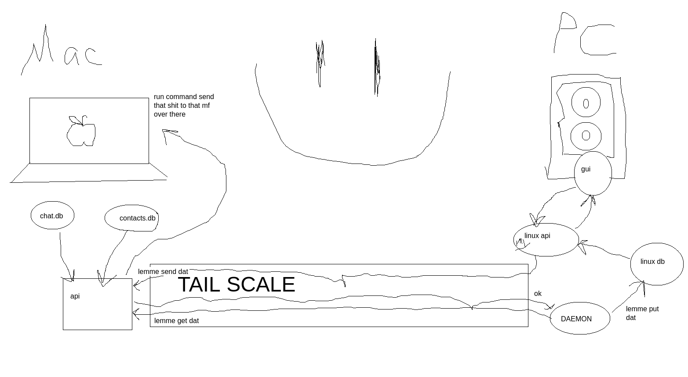
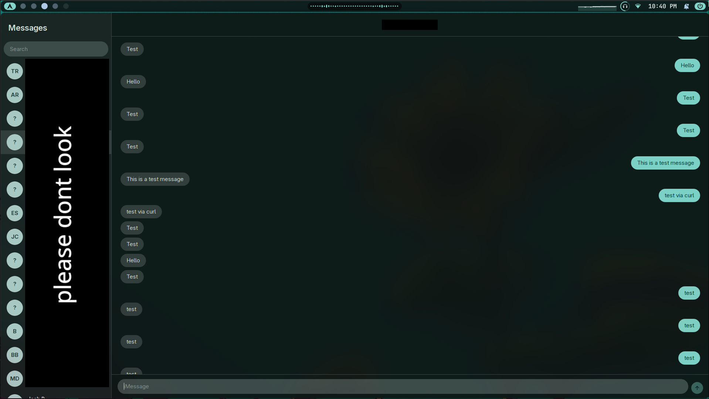

# Bluer Bubbles

> A slightly bluer, objectively worse BlueBubbles client.

Bluer Bubbles is a desktop client for iMessage built with **Tauri**, **React**, and **Python**.

It connects to a **Mac** running the companion API over a private **Tailscale** network, allowing messages to be synchronized to Linux.

Despite the name, I have no idea how BlueBubbles works. This project was built from scratch after someone mentioned that Tailscale could be used to connect a Linux machine to a Mac running iMessage.

It exists solely for my personal benefit.

## Architecture

This is the idea.

Here's what it looks like.

## How it works

- A **Mac** runs the Bluer Bubbles API.
- The API reads from Apple's Messages database located at `~/Library/Messages/chat.db`.
- Tailscale securely links the Mac to another device.
- A Linux daemon polls for new messages every two seconds and stores them in a local SQLite database.
- A local API exposes that database to the Tauri/React GUI.
- When you send a message, the local API forwards it through Tailscale to the Mac API, which sends it using AppleScript.

## Status

Currently a working proof-of-concept.

Works:
- Text message synchronization
- Sending messages from Linux through iMessage
- Tailscale-based communication
- Desktop GUI

Does not work YET:
- Group chats
- Attachments
- Stickers

## Tech Stack

| Component | Technology |
| --- | --- |
| Desktop Client | Tauri + React |
| Backend API | Python |
| Local Storage | SQLite |
| Networking | Tailscale |
| macOS Integration | AppleScript |

## Requirements

- A Mac with access to iMessage
- Tailscale installed on both machines
- A Linux machine for the daemon and GUI

More updates to come.
